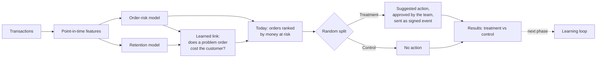

# Customer Growth Intelligence

**A decision-support system that tells an online retailer which orders to act on before they are returned or cancelled,
which customers are likely to come back, and - through a built-in randomised experiment - whether acting actually pays off.**

[Live demo](https://YOUR-APP.streamlit.app) · [Case study documents](docs/) · [Notebooks](notebooks/)


---

## Project at a glance

| | |
|---|---|
| **Business** | UK online gift & homeware retailer selling to consumers and wholesale buyers |
| **Problem** | Returns and cancellations cost money; the team can only check a few orders a week and has no proof that checking helps |
| **Objective** | Focus the team's limited time on the orders with the most money at risk, and measure the effect of every action |
| **Data** | About 1M real transaction lines, 5,900 customers, Dec 2009 - Dec 2011 (Online Retail II, UCI). Discovery phase on the Olist marketplace (99k orders) |
| **Deliverables** | Two validated models, a learned "problem → retention" link, an experiment framework, a simulation lab, a 6-page web app with signed action delivery, full documentation |
| **Stack** | Python · pandas · scikit-learn · Streamlit · Altair · Kaggle notebooks · HMAC-signed webhooks |

## The problem

A retailer ships hundreds of orders a week. Some come back or are cancelled, wasting stock handling, shipping and staff time.
The operations team could prevent some of them - confirm quantities with the customer, quality-check an item that is often
returned - but only has time for a few dozen orders a week. Two questions follow:

1. **Which orders deserve that time?**
2. **Does the intervention actually work, or would those orders have been fine anyway?**

## The solution



- **Order-risk model** scores every order at the moment it is placed: will it be returned or cancelled within 30 days?
- **Retention model** scores every active customer: will they buy again within 90 days?
- **Today** ranks orders by **money at risk** (chance of a problem × order value), explains each in one sentence and suggests an action.
- **Built-in experiment**: half of the flagged orders are held back at random as a control group, so the effect of acting is measured, not assumed.
- **Simulation lab** tests the whole system against effects you set, before any real money is spent.

## Results and business impact

| What | Result | What it means for the business |
|---|---|---|
| Order-risk model | AUC **0.737** on months it never saw (simple rule: 0.677) | Orders flagged High had a problem **41%** of the time vs **7%** for Low and **15%** on average: the team's checks land on orders **2.7× more likely** to go wrong |
| Retention model | AUC **0.793** (simple rule: 0.756) | Customers flagged High bought again **92%** of the time vs **16%** for Low: retention spend can be aimed precisely |
| Calibration | Expected 14.5%, actual 14.8% on the latest 3,849 orders | The risk numbers can be used for planning, not just ranking |
| Learned link | Customers with a return came back **more** often (57.7% vs 33.1%) | In this business, returns are mostly wholesale adjustments: acting on risky orders protects margin, not loyalty. The system detects this instead of assuming it |
| Ranking choice (simulation) | Money-at-risk ranking saved **92-97%** of the maximum in all 8 scenarios | Adopted as Today's ranking: same team effort, more money protected |
| Experiment readiness (simulation) | Finds real effects, raises no false alarms, and tells you how many weeks a test needs | Decisions about actions are based on evidence, with a clear stopping point |
| Illustrative value (simulation, scenario A) | About **£54k protected over 18 weeks** at 30 checks a week | If actions worked as assumed. A real experiment on current orders turns this into a measured number |

Full numbers: [docs/06_RESULTS_AND_IMPACT.md](docs/06_RESULTS_AND_IMPACT.md)

## Features

| Page | What it does |
|---|---|
| **Overview** | This week's orders and money at risk, model reliability, predicted vs actual problem rate over time |
| **Today** | The work queue ranked by money at risk; reason and suggested action per order; approve or skip; one confirm |
| **Results** | Treatment vs control with intervals, a fairness check, and progress towards a reliable answer |
| **System health** | Is the model still accurate? Does a problem order cost the customer here? |
| **Simulation lab** | "What if the actions worked?" - set the effects, see whether the experiment finds them, how long it takes, and which ranking saves most |
| **How it works** | Model cards against simple rules, validation design, experiment design, limitations |

Also: practice mode (nothing sent), signed and idempotent webhook delivery, a local mock receiver, a public-demo mode, and
a dataset-agnostic design (a new dataset is a data package, not a rewrite).


## Skills demonstrated

| Area | In this project |
|---|---|
| Problem framing | Turned "grow customers" into decisions a team can act on weekly; changed the target when the first one proved unpredictable |
| Data preparation | Grain control, de-duplication, split-checkout detection, return-to-purchase matching |
| Feature engineering | Point-in-time features with an automated leakage check; shrunk rates for sparse customers and products |
| Modelling | Logistic regression, gradient boosting, survival model, uplift (T-learner), text features |
| Validation | Out-of-time tests with gaps, customer-level bootstrap intervals, simple-rule baselines, pre-registered success criteria |
| Experimentation | Randomised control group, power analysis, sample-ratio checks, intention-to-treat, A/A testing |
| Simulation | Synthetic experiments with known effects to test detection, sample size and targeting policies |
| Engineering | Streamlit multi-page app, packaging, HMAC-signed webhooks, idempotency, retries, deployment |
| Judgement & communication | Documented negative results, honest limits, plain-language UI for non-technical users |

## Documentation

| | |
|---|---|
| [01 Project scope](docs/01_PROJECT_SCOPE.md) | Business context, objectives, scope, success criteria, deliverables |
| [02 Solution blueprint](docs/02_SOLUTION_BLUEPRINT.md) | Architecture, data flow, components, technology choices |
| [03 Delivery process](docs/03_DELIVERY_PROCESS.md) | The project phase by phase, including the discovery phase on Olist and why the data changed |
| [04 Models and validation](docs/04_MODELS_AND_VALIDATION.md) | Data preparation, features, models, how they were tested |
| [05 Experimentation and simulation](docs/05_EXPERIMENTATION_AND_SIMULATION.md) | Experiment design and the simulation lab |
| [06 Results and business impact](docs/06_RESULTS_AND_IMPACT.md) | All results and what they mean for the business |
| [07 App guide](docs/07_APP_GUIDE.md) | Every page, how a user works with it |
| [08 Running and deployment](docs/08_RUNNING_AND_DEPLOYMENT.md) | Install, rebuild data, test sending, deploy, troubleshoot |
| [09 Limitations and roadmap](docs/09_LIMITATIONS_AND_ROADMAP.md) | What this does not prove yet and what comes next |

## Quick start

```
py -3.12 -m venv .venv312
.venv312\Scripts\activate
pip install -r requirements.txt
streamlit run app.py
```

## Repository

```
app.py              navigation and sidebar
core.py             scoring, explanations, work queue, replay, health checks
sim.py              simulation engine: assumed effects, power, targeting rules, uplift model
experiment.py       experiment statistics (Wilson, Newcombe, sample-ratio check, power)
dispatcher.py       treatment/control assignment, signed webhook delivery, decision log
datasets_ui.py      per-dataset wording: reasons, actions, message templates
make_package.py     turns notebook outputs into a dataset package
mock_receiver.py    local webhook endpoint for testing
views/              the app pages
packages/retail/    the dataset package the app reads (models + scored orders)
notebooks/          Kaggle notebooks (Online Retail II, and the Olist discovery phase)
docs/               case-study documents and screenshots
```

## Data

Online Retail II, Daqing Chen, UCI Machine Learning Repository (CC BY 4.0). Olist Brazilian E-Commerce Public Dataset (Kaggle).
