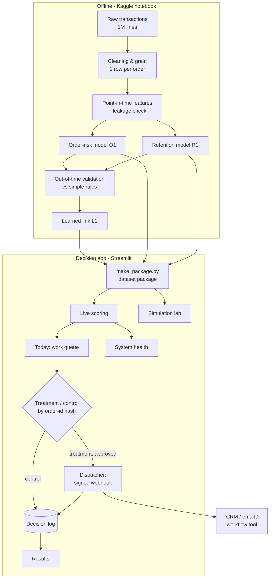

# 02 · Solution blueprint

## End-to-end flow



## Components

| Component | File | Responsibility |
|---|---|---|
| Analysis notebook | `notebooks/retail_growth_v1.ipynb` | Clean data, build features, train and validate both models, measure the link, export everything |
| Packager | `make_package.py` | Turn notebook outputs into `packages/<name>/` (models, scored orders, metadata) |
| Core | `core.py` | Load a package, score live, rank the queue, explain each order, replay past weeks, health checks |
| Wording | `datasets_ui.py` | The only dataset-specific part: reasons, actions, message templates |
| Experiment statistics | `experiment.py` | Wilson and Newcombe intervals, z-test, sample-ratio check, power, readout |
| Simulation | `sim.py` | Assumed effects, simulated experiments, power curves, targeting rules, uplift model |
| Dispatcher | `dispatcher.py` | Deterministic treatment/control assignment, HMAC-signed delivery, retries, idempotency, decision log |
| Pages | `views/*.py` | Overview, Today, Results, System health, Simulation lab, How it works, Experiment details |
| Test receiver | `mock_receiver.py` | Local endpoint that verifies signatures, for testing delivery |

## Design principles

1. **Decisions, not dashboards.** Every page ends in something a person can do or decide.
2. **Measure, don't assume.** Every action is part of an experiment with a control group; the link between problems and
   retention is learned per business.
3. **Honest numbers.** Models are tested only on later months, compared with simple rules, and scored live from the saved model.
4. **Simple in front, rigorous behind.** Plain-language screens; statistics one click away.
5. **Dataset-agnostic.** A new business is a new data package plus a few lines of wording, not a rewrite.
6. **Safe by default.** Practice mode sends nothing; live sending needs a secret and a confirmation; nothing is sent twice.

## Technology choices

| Need | Choice | Why |
|---|---|---|
| Analysis and training | Python, pandas, scikit-learn on Kaggle | Free compute, reproducible notebooks, standard tools |
| Models | Logistic regression, gradient boosting | Strong on tabular data, fast, explainable; heavier models were tested and did not help |
| App | Streamlit + Altair | Fast to build, easy to host for free, good charts |
| Action delivery | Webhooks signed with HMAC-SHA256 | Works with any CRM or workflow tool; receiver can verify the sender |
| Hosting | Streamlit Community Cloud | Free public demo; `PUBLIC_DEMO` mode disables sending |

## Data package format

```
packages/retail/
  package.json        names, model metadata, validation results, bands, learned link, experiment settings
  order_model.joblib  the order-risk model
  orders.csv          every order with its purchase-time features, outcome (when known) and the customer's retention score
```
