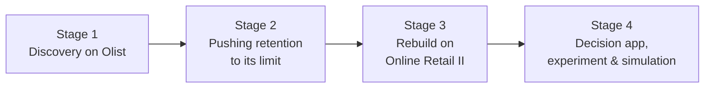

# 03 · Delivery process

The project ran in four stages. The first stage, on a different dataset, did not lead to a usable retention model -
and documenting why is part of the work.

---

## Stage 1 · Discovery on Olist (Brazilian marketplace, 99k orders)

| Step | Done | Found | Decided |
|---|---|---|---|
| 1.1 Data understanding | Chose the real customer key (`customer_unique_id`), defined "value orders", built customer features, two-stage segmentation (all customers / repeat customers) | Only about 3% of customers ever ordered twice | Use fixed follow-up windows; never invent time-between-purchases for one-time buyers |
| 1.2 First-order analysis | Tested basket size, product variety and spend against repeat buying within 180 days | Variety looked strong (2.9% → 10.5%) but **about 38% of "repeaters" had only re-ordered within the same checkout** - the marketplace splits multi-seller carts | A repeat must be a separate occasion, at least a day later |
| 1.3 Code review and rebuild | Reviewed a notebook from another AI tool; rebuilt a clean pipeline | It contained an invented "+32% voucher effect", a synthetic dataset used as "validation", and a test that leaked future data | One definition per concept; honest out-of-time tests only |
| 1.4 First app | Streamlit app, signed webhook dispatcher, control group, dry-run mode | A bug left the live experiment without a control group; fixed | Practice decisions must never block live ones |
| 1.5 Order risk (v3) | Predicted "order goes wrong" (late, bad review, canceled) at purchase time, with point-in-time seller history | AUC 0.628 (late deliveries 0.673); a bad first order went with fewer returning customers (1.68% vs 2.01%) | Order risk is predictable and actionable |

## Stage 2 · Pushing retention to its limit (Olist)

| Step | Done | Found |
|---|---|---|
| 2.1 Honest scoring moment (v2) | Scored customers after delivery and review, removed those already returned | AUC 0.516: no reliable ranking |
| 2.2 More information (v2.1) | 43 features, 180- and 90-day windows, gradient boosting, pass rule fixed in advance | AUC 0.557: a narrow pass; product category the most informative |
| 2.3 More data (v2.2) | Survival model using all customers' partial follow-up (4× more events), category rates, review-text sentiment | No improvement (0.500-0.550) |

**Decision:** the limit was the data - almost nobody comes back. Move to data where customers do return.

## Stage 3 · Rebuild on Online Retail II (UK retailer, 1M lines)

| Step | Done | Found |
|---|---|---|
| 3.1 Data choice | Picked a real dataset with repeat customers and recorded returns for the same customers | Both models and their link can be built on one population |
| 3.2 Retention (R1) | Monthly snapshots, history-only features, tested on the last four months | AUC 0.793, beating "orders in the last year" (0.756) |
| 3.3 Order risk (O1) | Returns matched to purchases; point-in-time customer and product return rates; leakage check | AUC 0.737, beating the customer's past return rate (0.677) |
| 3.4 Link (L1) | Returners vs non-returners at similar activity | Returners came back **more** often - the opposite of Olist |

**Decision:** the problem-to-retention link must be learned per business, never hard-coded.

## Stage 4 · Decision app, experiment and simulation

| Step | Done | Outcome |
|---|---|---|
| 4.1 Dataset packages | `make_package.py`; the app reads any package | Olist removed once retail covered both models |
| 4.2 Simple screens | Today, Results, System health in plain language | Usable without statistics knowledge |
| 4.3 Portfolio polish | Overview, compact work queue, theme, public-demo mode, How-it-works page | Presentable to reviewers and managers |
| 4.4 A/A replay | Replayed June-October 2011 through the experiment | Groups alike (43.9% vs 41.1%, p = 0.45): the comparison is fair |
| 4.5 Simulation lab | Real orders, assumed effects; detection, sample size, targeting rules, uplift model | No false alarms; money-at-risk ranking saves 92-97% of the maximum |
| 4.6 Ranking change | Today switched from "riskiest first" to "most money at risk first" | Evidence-based choice from 4.5 |

## Working practices used throughout

- **Pre-registered success criteria** before each modelling run.
- **Simple-rule baselines**: a model must beat the best single number or it isn't used.
- **Negative results kept**: the Olist retention ceiling is documented, not hidden.
- **Reproducible notebooks** on Kaggle; every number in the app is computed, none typed in.
- **Testing before delivery**: every notebook and page was first run on synthetic data shaped like the real data.
