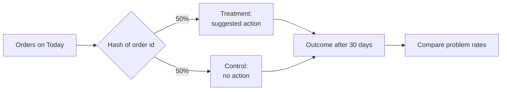

# 05 · Experimentation and simulation

## Why an experiment is built in

A model can say an order is risky. It cannot say whether calling the customer prevents the return. If the team acts on
risky orders and returns go down, that could be the action - or the season, or luck. The only reliable way to know is
to compare with similar orders that got **no** action.

## Experiment design

| Element | Choice | Why |
|---|---|---|
| Unit | The order | The outcome (returned or cancelled) belongs to the order |
| Assignment | Hash of order id + experiment name, 50/50 | Random, decided before anyone sees the order, identical on every rerun |
| Who is counted | Everyone assigned (intention-to-treat); skipped orders stay in treatment | Measures what happens when the team *tries* to act - the realistic effect |
| Comparison | Problem rate in each group with Wilson intervals; difference with a Newcombe interval and a two-proportion z-test | Correct for low and high rates, honest uncertainty |
| Fairness check | Sample-ratio mismatch test on the split | Catches broken assignment before results are trusted |
| Sample size | Power calculation shown on Results | Prevents stopping early on a lucky result |
| Practice mode | Logged, never counted, never blocks live decisions | Safe training without polluting the experiment |
| Delivery | HMAC-SHA256 signature, idempotency key, retries on 5xx/429/timeouts | The receiving system can trust the event and never acts twice |

## A/A replay: proving the comparison is fair

The data is historical, so no real action was ever taken. Replaying June-October 2011 through the experiment and
comparing the two groups on their *real* outcomes must show **no** difference - any difference would mean assignment is
biased. Result: 43.9% vs 41.1% problems, p = 0.45. The groups are alike.

## Simulation lab: "what if the actions worked?"

An A/A test proves fairness, but not that the experiment can *find* an effect. The simulation lab keeps the real orders and
outcomes, and lets you **assume** how well each action works:

- a treated order the team acts on loses its problem with the probability you set for that action,
- optionally only for returning customers (a hidden pattern the system must discover),
- with a chosen approval rate and team capacity.

It then answers four questions:

| Question | How |
|---|---|
| Does the test find the effect? | Runs the exact Results analysis and compares the estimate with the true assumed effect |
| How many orders until we can be sure? | 300 simulated experiments at each size from 250 to 8,000 orders; the share that find the effect |
| Which orders should the team pick? | Compares riskiest first, biggest first, most money at risk first, an uplift model, random, and a perfect-knowledge ceiling |
| Can a model learn who the action helps? | Trains an uplift model (T-learner: two gradient-boosting models, treated vs control) on a simulated broad experiment, never showing it the assumptions |

### Test plan and results

Each test changes one setting compared with A (effects 30% / 20% / 10%, returning customers only, 90% approved, 30 orders a week).

| Test | Changed | Effect found? | Weeks to be sure | Money saved (money-at-risk ranking) |
|---|---|---|---|---|
| A | - | Yes | 63 | £54.4k (92% of max) |
| B | effects 50/50/50 | Yes | 16 | £146.0k (97%) |
| C | effects 10/10/10 | No | too long | £29.2k (97%) |
| D | everyone benefits | Yes | 63 | £56.0k (94%) |
| E | 50% approved | No | 254 | £30.2k (92%) |
| F | 80 orders a week | Yes | 48 | £75.6k (94%) |
| G | no effect | **No** (correct) | too long | £0 |
| H | different luck | No, No, No | 63 | £54.4k |

**Conclusions**
1. **No false alarms** (G), and found effects land close to the truth.
2. **Strong actions are proven in months, weak ones may never be** (B vs C).
3. **Approval rate matters as much as action quality** (E): half approval nearly halves the effect.
4. **More checks per week shorten the test** (F).
5. **One early "Yes" can be luck** (A vs H): run for the full time needed.
6. **Money-at-risk ranking is the robust choice**: 92-97% of the maximum in every test; adopted for Today.
7. **The uplift model isn't worth it yet**: it needs a much larger real experiment first.

The simulation designs the operation. Only a real experiment on current orders can prove that a given action works.
