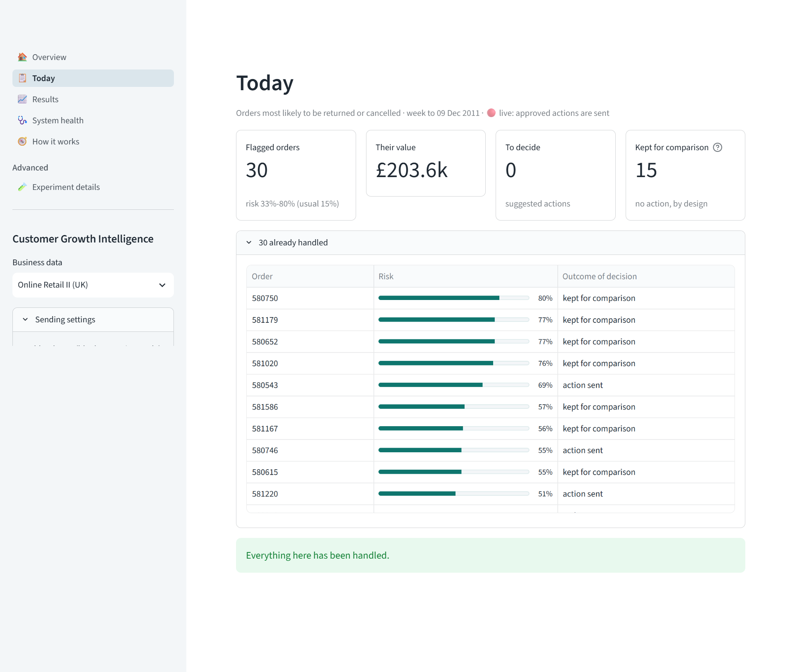
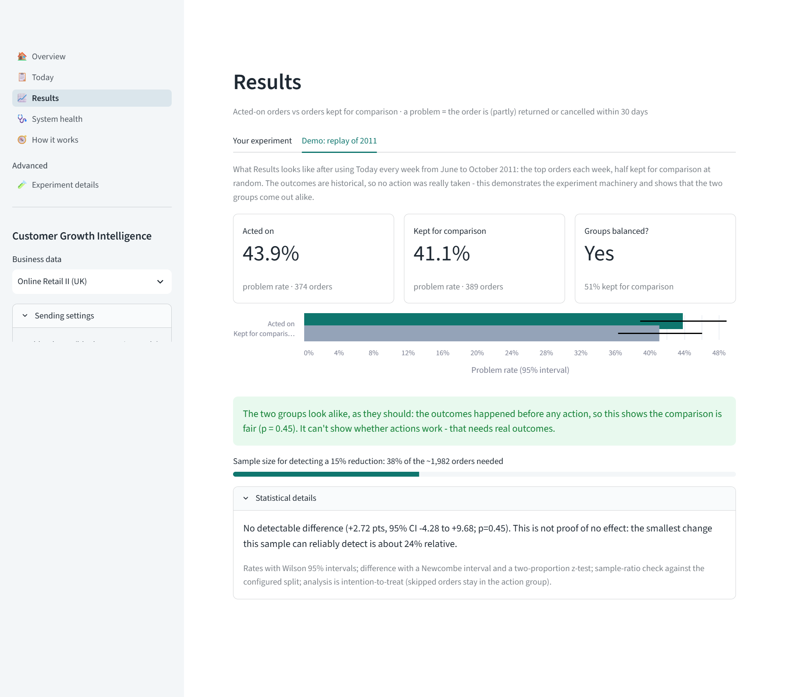
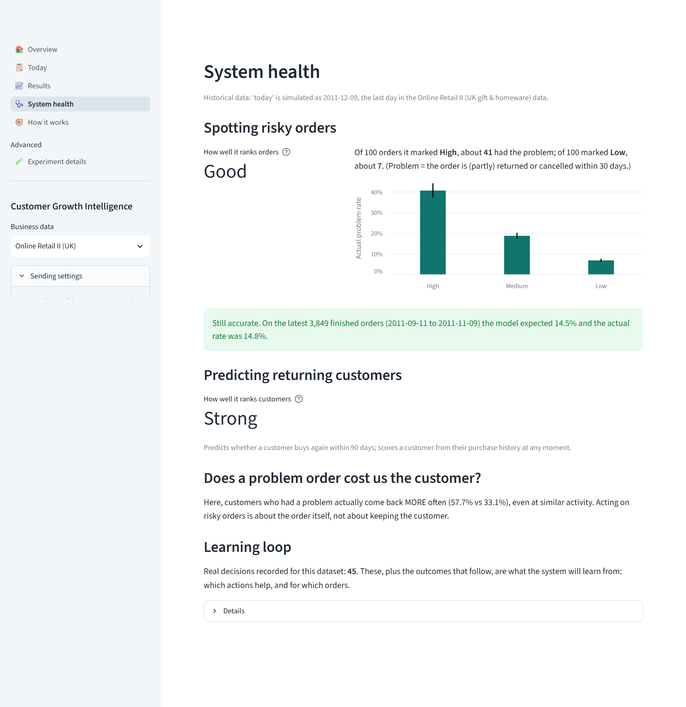
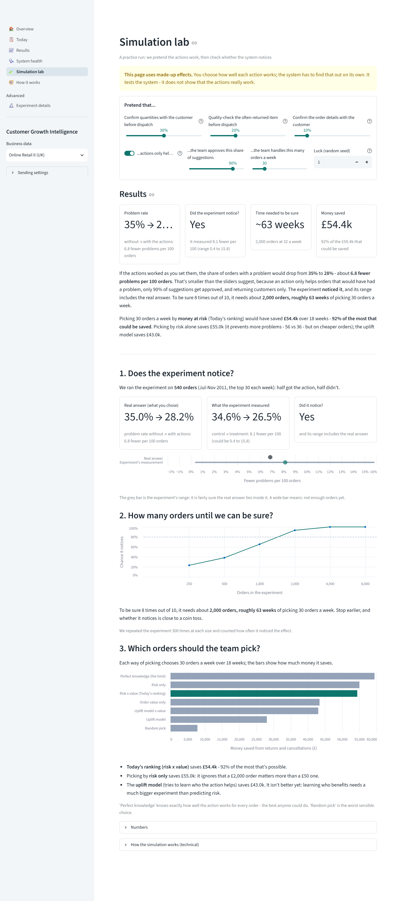

# 07 · App guide

The app has five main pages, a How-it-works page and one advanced page. Everything a non-technical user needs is on the
first screen of each page; statistics are in expandable sections.

## Overview
*For: anyone, in 30 seconds.*

- One sentence: how many orders are high-risk this week, what they are worth, how many are expected to have a problem.
- Four boxes: high-risk orders, their value, order-model reliability, retention-model reliability.
- A chart of predicted vs actual problem rate per week - shows the model's numbers match reality.
- Links to Today, Results and How it works.

## Today
*For: the operations team, weekly.*

1. Boxes at the top: orders to look at, money at risk, actions to decide, orders in the control group.
2. One table, ranked by **money at risk** (chance of a problem × order value): risk bar, value, amount at risk, main reason,
   suggested action. All suggestions are ticked; untick to skip (a reason is asked).
3. "Preview the messages" shows what would be sent.
4. The control group (chosen at random, no action) and already-handled orders are listed in collapsed sections.
5. One **Confirm** button. In practice mode nothing is sent; in live mode a confirmation tick is required.

Sidebar settings: the date treated as "today" (to replay the past), how many days and orders to show, control-group size,
and "Clear practice decisions".

## Results
*For: managers and the data team.*

- A three-step explanation of the experiment at the top.
- **Your decisions:** treatment vs control problem rates, a chart with intervals, a verdict in plain words, and a progress
  bar towards a reliable answer. Outcomes come from history (a fairness check) or an uploaded file of real outcomes.
- **Example: a simulated 5-month run:** what Results looks like after months of use, so the page is never empty.

## System health
*For: the data team.*

- How well each model ranks ("Strong", "Good", "Fair", "Weak"), with what happened in each risk band.
- Whether predictions still match reality on the latest finished orders (warns when drifting).
- Whether a problem order costs the customer in this business.
- How many real decisions the learning loop has collected.

## Simulation lab
*For: planning an experiment.*

- "Pretend that…": how well each action works, whether only returning customers benefit, approval rate, orders per week, luck.
- **Results** on top: problem rate with actions, whether the test found the effect, weeks needed to be sure, money saved.
- 1 · Does the test find the effect? 2 · How many orders until we can be sure? 3 · Which orders should the team pick?

## How it works
Model cards against simple rules, risk-band charts, validation design, the learned link, experiment design, the Olist
discovery phase and limitations. Written for a technical reviewer.

## Advanced · Experiment details
The full statistical readout of any experiment in the decision log, a power calculator, and A/A checks.

## Sidebar
- **Business data:** the dataset package in use.
- **Sending settings:** webhook URL and signing secret (hidden in public-demo mode). Empty URL = practice mode.
